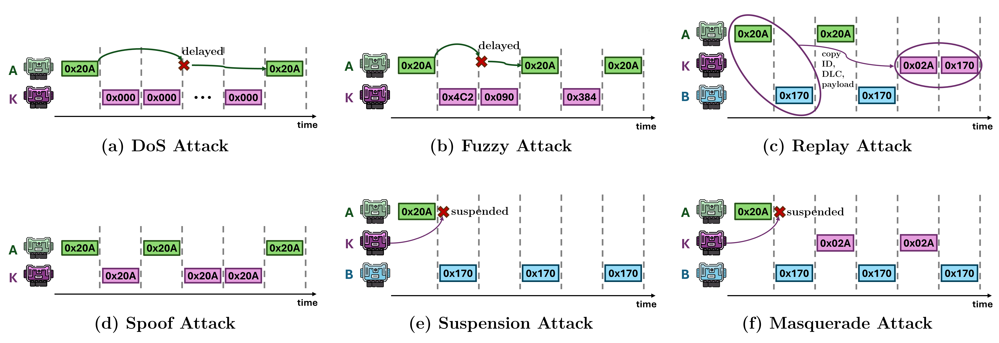

# CANini: Nominal & Parameterized CAN Bus Attack Dataset for Intrusion Detection Systems

This repository contains a link to the CANini dataset, which is too large to be uploaded directly to GitHub. You can download the entire dataset from the Google Drive Folder in the link below:
[Download](https://drive.google.com/drive/folders/1PRpj1szJDsWvfP7upyny1vBQDeYZDn8f?usp=drive_link)

## Dataset Description

The CANini dataset offers ...???... includes data generated from various attacks and benign scenarios in the context of communication networks.
**Figure 1** schematically depicts the nature of the attack types provided in this dataset.

It is divided into two main categories: Attacks and Benign Scenarios.


*Figure 1: Examples of known attacks on CAN network, highlighting the order and periodicity of considered frames. ECUs A and B are legitimate, while K is the attacker.*

## Repository Organization


*Figure 2: Structure of the repository of our dataset, CANini, which comprehends CAN-MIRGU dataset and our extension with further benign and attack CAN traces.*

### Attack Traces

1. **\<name attack\>.csv**
   - CAN traffic trace containing a specific attack, in CSV file format. Attacks (a)-(d) of **Figure 1** are performed by injecting malicious CAN frames in real-time into the vehicle's CAN network. Attacks (e) and (f) of **Figure 1** are simulated modifying some attack or benign trace by hand. 
   - Snapshot example:
      ```csv
      timestamp,arbitration_id,data_field,dlc_value,attack
      1698233010.284626,372,2F002500EE1E0000,8,0
      1698233010.284628,381,80B0390000128005,8,0
      1698233010.285633,07F,00C3000000000000,8,1
      1698233010.285637,436,00000000,4,0
      1698233010.285638,595,00006BFFF30E0000,8,0
      1698233010.286656,340,1300000400002811,8,0
      1698233010.286658,485,00000000,4,0
      ...
      ```
2. **\<name attack\>_Param.csv**
   - CAN traffic trace containing a specific attack that has been modified through the Py script provided, in CSV file format.

### Benign Traces

1. **\<name benign\>.csv**
   - CAN traffic trace containing the benign traffic gathered from the real vehicle, in CSV file format.

2. **\<name benign\>_Param.csv**
   - CAN traffic trace containing the benign traffic that has been modified through the Py script provided, in CSV file format.

### Metadata

1. **Attacks_metadata.json**
   - JSON file containing metadata for all the attack traces contained in the unmodified part of the dataset.

### Python Scripts

1. **generate_parameterized_file.py**
   - Python script that picks the selected original file (*\<name\>.csv*), and generates a new file (*\<name\>_Param.csv*) in the destination *PARAMETERIZED* folder with identical path. This way, the two main folders will have the same internal structure.
   - **Configuration parameters of the script**
     ```Python
     input_relative_path = "CAN-MIRGU/Attack/Real_attacks/Break_and_fog_light_attack.csv"  # Example relative path
     ```
     This variable contains the relative path, from the Py script down to the selected CSV file.
     
     ```Python
     valid_arbitration_ids = ["164", "4F1"]  # Example arbitration IDs to modify
     ```
     This variable contains the list of the ID to be modified in the selected CSV file.
  
     ```Python
     modify_all = True   # Modify all rows (if True) or only rows with attack_flag = 1 (if False)
     ```
     This variable should be *True* to modify all the CAN frames of the selected ID(s); otherwise, *False* to modify only the malicious CAN frames (independently of their ID). This flag, when *False*, overwrites the variable *valid_arbitration_ids*
     
     ```Python
     awgn_std_dev = 0   # Example AWGN standard deviation factor
     awgn_mean = 0      # Example AWGN mean factor
     ```
     These two variables control the modification of the data bytes of the selected CAN frames in the selected CSV file. They define the mean and std.dev of the AWGN inserted into each byte, as in following equation

     $$noisyByte_i = originalByte_i + N(\mu, \sigma)$$
     
     ```Python
     temporal_shift = 2 / 1000   # Example temporal shift in seconds
     ```
     This variable control the modification of the absolute arrival time of the selected CAN frames in the selected CSV file. The shift is applied in the order of seconds, and it can be positive or negative.
     
## Notes

- **File Format**: All files are in CSV, JSON, and Python script formats. They can be opened with data management software such as Excel, Python (pandas), or JSON viewers.
- **License**: This work is licensed under the [Creative Commons Attribution 4.0 International (CC BY 4.0) License](https://creativecommons.org/licenses/by/4.0/).
- **Contact**: For any questions or clarifications, feel free to reach out to me via email [nicasio.canino@phd.unipi.it](mailto:nicasio.canino@phd.unipi.it)

## Citation

If you use this dataset in your work, please cite the following articles:

```latex
@article{can_ini_dataset,
  title={{CANini}: In-Depth Traffic Analysis for Design and Robustness Testing of DTree-based IDS in Automotive Networking Systems},
  author={Canino, Nicasio and Dini, Pierpaolo and Mazzetti, Stefano and Rossi, Daniele and Saponara, Sergio},
  journal={IEEE Access},
  year={2025},
  volume={X},
  number={X},
  pages={XX-XX},
  publisher={IEEE}
}

@article{can_mirgu_dataset,
  title={{CAN-MIRGU}: A Comprehensive CAN Bus Attack Dataset from Moving Vehicles for Intrusion Detection System Evaluation},
  author={Rajapaksha, Sampath and Madzudzo, Garikayi and Kalutarage, Harsha and Petrovski, Andrei and Al-Kadri, M Omar},
  booktitle={Symposium on Vehicles Security and Privacy. Internet Society},
  year={2024}
}
