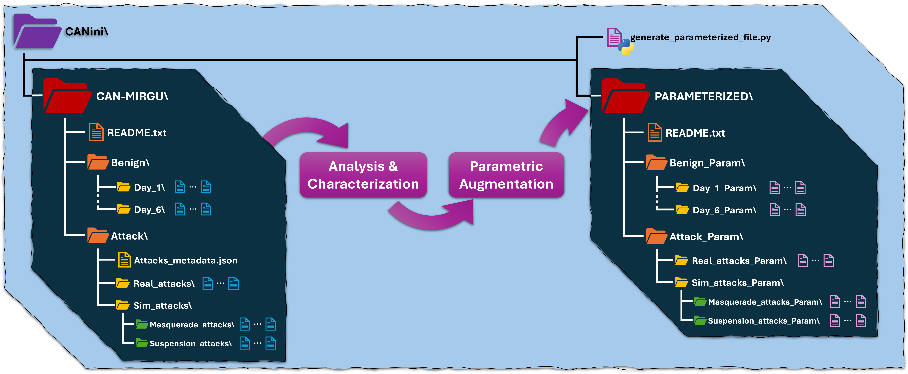

# CANini: Nominal & Parameterized CAN Bus Attack Dataset for Intrusion Detection Systems

This repository contains a link to the CANini dataset, which is too large to be uploaded directly to GitHub. You can download the entire dataset from the Google Drive Folder in the link below:
[Download](https://drive.google.com/drive/folders/1PRpj1szJDsWvfP7upyny1vBQDeYZDn8f?usp=drive_link)

## Dataset Description

The CANini dataset offers ...???... includes data generated from various attacks and benign scenarios in the context of communication networks. It is divided into two main categories: Attacks and Benign Scenarios.

## Repository Organization



### Attacks

1. **\<name of attack\>.csv**
   - Description: CAN traffic trace containing a specific attack in CSV file format.
   - Example:
```csv
timestamp,arbitration_id,data_field,dlc_value,attack
1698232894.363802,153,208010FF00FFB05E,8,0
1698232894.363804,160,00E7FF0A00000012,8,0
1698232894.363806,164,00080A02,4,0
1698232894.363807,220,9F837B0000040F59,8,0
1698232894.364776,54B,0010000000870100,8,0
...
```

### Benign Scenarios

1. **dummy_b.csv**
   - Description: Benign data recorded on the first day.

### Metadata

1. **dummy_metadata.json**
   - Description: JSON file containing metadata for the dataset.

### Python Scripts

1. **dummy_python.py**
   - Description: Python script for analyzing the dataset.

## Notes

- **File Format**: All files are in CSV, JSON, and Python script formats. They can be opened with data management software such as Excel, Python (pandas), or JSON viewers.
- **License**: This work is licensed under the [Creative Commons Attribution 4.0 International (CC BY 4.0) License](https://creativecommons.org/licenses/by/4.0/).
- **Contact**: For any questions or clarifications, feel free to reach out to me via email [nicasio.canino@phd.unipi.it](mailto:nicasio.canino@phd.unipi.it)

## Citation

If you use this dataset in your work, please cite the following articles:

```latex
@article{can_ini_dataset,
  title={{CANini}: In-Depth Traffic Analysis for Design and Robustness Testing of DTree-based IDS in Automotive Networking Systems},
  author={Canino, Nicasio and Dini, Pierpaolo and Mazzetti, Stefano and Rossi, Daniele and Saponara, Sergio},
  journal={IEEE Access},
  year={2025},
  volume={X},
  number={X},
  pages={XX-XX},
  publisher={IEEE}
}

@article{can_mirgu_dataset,
  title={{CAN-MIRGU}: A Comprehensive CAN Bus Attack Dataset from Moving Vehicles for Intrusion Detection System Evaluation},
  author={Rajapaksha, Sampath and Madzudzo, Garikayi and Kalutarage, Harsha and Petrovski, Andrei and Al-Kadri, M Omar},
  booktitle={Symposium on Vehicles Security and Privacy. Internet Society},
  year={2024}
}
